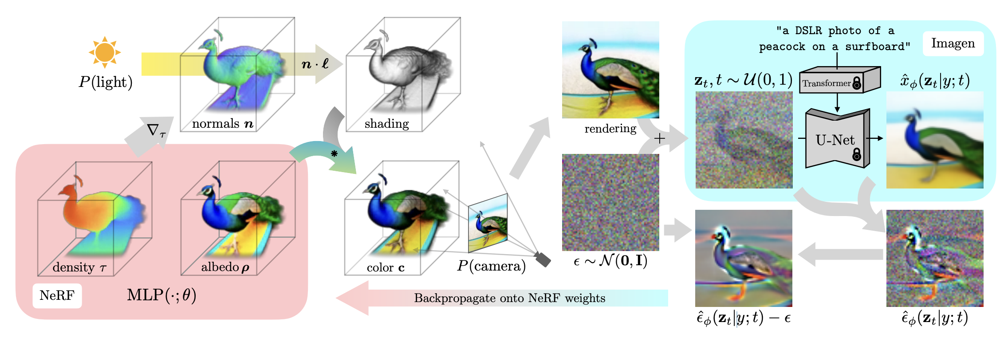
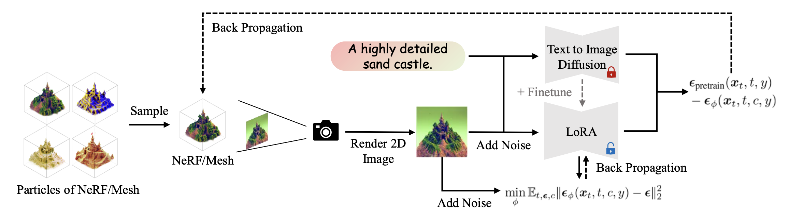

<div align=center>
  <h1>
    Score Distillation Sampling 
  </h1>
  <p>
    <a href=https://mhsung.github.io/kaist-cs492d-fall-2024/ target="_blank"><b>KAIST CS492(D): Diffusion Models and Their Applications (Fall 2024)</b></a><br>
    Programming Assignment
  </p>
</div>

<div align=center>
  <p>
    Instructor: <a href=https://mhsung.github.io target="_blank"><b>Minhyuk Sung</b></a> (mhsung [at] kaist.ac.kr)<br>
    TA: <a href=https://jh27kim.github.io/ target="_blank"><b>Jaihoon Kim</b></a>  (jh27kim [at] kaist.ac.kr)
  </p>
</div>

<div align=center>
  
</div>


## Description
Score Distillation Sampling (SDS) is a technique used in generative models, particularly in the context of diffusion models. It leverages a pretrained model to guide the generation or editing of target samples by distilling the score (a measure of how well the sample aligns with the target distribution) back into the sampling process. Distillation sampling is particularly useful when pretrained diffusion models cannot directly generate target samples (e.g., 3D objects). In this programming assignment, we will begin with a simple application, 2D image generation using SDS and its variants. Unlike the reverse process of a diffusion model, distillation sampling parameterizes the target content (e.g., images) and optimizes the parameters based on a predefined loss function. Next, we will edit the given source images to align with target prompts using Posterior Distillation Sampling (PDS). 

## Setup
```
conda create -n cs492d python=3.8
conda activate cs492d 
pip install -r requirements.txt
```
Install PyTorch with your CUDA version. [PyTorch Previous Versions](https://pytorch.org/get-started/previous-versions/).

For environment with CUDA 12.1:

```
pip install torch==2.1.0 torchvision==0.16.0 torchaudio==2.1.0 --index-url https://download.pytorch.org/whl/cu121
```

## Code Structure 
```
.
├── data
│   ├── imgs                      <--- Source images for editing tasks 
│   └── prompt_img_pairs.json     <--- Metadata of text prompts and source images
├── eval.py                       <--- CLIP score evaluation code 
├── guidance
│   └── sd.py                     <--- (TODO) Implement SDS and PDS
├── main.py                       <--- Entry point
└── utils.py                      <--- Utility functions 
```

## Task 0: Introduction
Distillation sampling parameterizes the target content (e.g., images) and optimizes the parameters using the gradient of the distillation loss function $\nabla_{x^0} L$. In this assignment, we denote $`c`$ as a text prompt, $`\mathbf{x^{t}}`$ as a noisy sample, $`\epsilon`$ as a random sample from a standard Gaussian distribution, and $`\epsilon_\theta(\cdot, \cdot, \cdot)`$ as a pretrained diffusion model that predicts the noise in the input. In the image editing task, $`\mathbf{x_{src}^{t}}`$ and $`\mathbf{x_{tgt}^{t}}`$ are used to denote the source and target samples, while $`c_{src}`$ and $`c_{tgt}`$ represent the source and target text prompts, respectively.

We provide text prompts and source images for generating and editing images. Change the `$HOME` prefix in image paths to your directory. For inference, use the `data/prompt_img_pairs.json`, which contains test prompts and source images. For each task, implement the loss function in `guidance/sd.py`. Use a fixed guidance scale for each task: 25 for SDS and 7.5 for PDS.

## Task 1: Score Distillation Sampling (SDS)

<p align="center">

</p>

In this task, you will generate images using SDS. First, initialize latent $\mathbf{x^{0}} \sim \mathcal{N}(0, I)$ where the resolution matches the pretrained diffusion model ($`1 \times 4 \times 64 \times 64`$). Then randomly sample timestep $t$ and add noise to the latent, which outputs $`\mathbf{x^{t}}`$ (Equation 4 in [DDIM](https://arxiv.org/abs/2010.02502)). Lastly, feed the noisy latent to the pretrained diffusion model $`\epsilon_\theta(\mathbf{x^{t}}, c, t)`$ and compute the SDS loss provided below, which will be used to update the latent $`x^{0}`$. To visualize the sampled latents, use `decode_latents()` in `guidance/sd.py`.

$$
\begin{align*} 
\nabla_{x^{0}} L_{sds}= \mathbb{E}_ {t, \epsilon} \left[ ( \epsilon_\theta(\mathbf{x^{t}}, c, t) - \epsilon ) \right].
\end{align*}
$$

### TODO

To generate imges using SDS loss run the following command:

```
python main.py --prompt "{$PROMPT}" --loss_type sds --guidance_scale 25
```

Refer to `data/prompt_img_pairs.json` for `prompt`.

Implement `get_sds_loss()` in `guidance/sd.py`. The function receives the latent image $\mathbf{x^{0}}$, text embedding $c$, and optionally, `guidance_scale` used for the Classifier Free Guidance weight ([CFG](https://github.com/KAIST-Visual-AI-Group/CS492-Assignment_Diffusion-Models/blob/assn1_ddpm/README.md#forward-process)). The function should return the computed loss of SDS. 

## Task 2: Posterior Distillation Sampling (PDS)

<p align="center">

</p>

The goal of PDS is to edit source image $`x_{src}`$ to align with the target prompt $`c_{tgt}`$. In doing so, PDS proposes to match the stochastic latents $`z^t`$ of the source and the target via the optimization. Recall that one step of the denoising process is given as follows:

$$
\begin{align*} 
\mathbf{x}^{t-1} = \mu(x^t, c, \epsilon_\theta) + \sigma^t \mathbf{z}^{t}, \quad \mathbf{z}^{t} \sim \mathcal{N}(0, I).
\end{align*}
$$

The stochastic latents can be obtained by reformulating the reverse step:

$$
\begin{align*} 
\tilde{z}^t (x^0, c, \epsilon_\theta) = \frac{x^{t-1} - \mu(x^t, c, \epsilon_\theta)}{\sigma^t}.
\end{align*}
$$

PDS computes the following loss to match the stocastic latents of source and target latents. Note that 

$$
\begin{align*} 
\nabla_{x_{tgt}^0} L_{pds} &= \mathbb{E}_ {t, \epsilon^t, \epsilon^{t-1}} \left[ ( \tilde{z}^t (x_{src}^0, c_{src}, \epsilon_\theta) - \tilde{z}^t(x_{tgt}^0, c_{tgt}, \epsilon_\theta) ) \right].
\end{align*}
$$

### TODO

To edit imges using PDS loss run the following command:

```
python main.py --prompt "{$PROMPT}" --loss_type pds --guidance_scale 7.5 --edit_prompt "{$EDIT_PROMPT}" --src_img_path {SRC_IMG_PATH}
```

Refer to `data/prompt_img_pairs.json` for `prompt`, `edit_prompt`, and `src_img_path`. Implement `get_pds_loss()` in `guidance/sd.py`. Note that $`\tilde{z}^t (x_{src}^0, c_{src}, \epsilon_\theta)`$ and $`\tilde{z}^t(x_{tgt}^0, c_{tgt}, \epsilon_\theta)`$ share the same noises $`\epsilon^t`$ and $`\epsilon^{t-1}`$ when computing $`x^{t}`$ and $`x^{t-1}`$.

## (Optional) Task 3: Variational Score Distillation (VSD)

<p align="center">

</p>

Variational Score Distillation (VSD) in ProlificDreamer aims to improve the sampling quality of SDS by utilizing [LoRA](https://mhsung.github.io/kaist-cs492d-fall-2024/programming-assignments/) to mimic the noise prediction of a pre-trained diffusion model. Given the pretrained diffusion model and a LoRA module, denoted as $\phi$, VSD optimizes the following loss:

$$
\begin{align*} 
\nabla_{x^{0}} L_{vsd}= \mathbb{E}_ {t, \epsilon} \left[ ( \epsilon_\theta(\mathbf{x^{t}}, c, t) - \epsilon_\phi(\mathbf{x^{t}}, c, t) ) \right].
\end{align*}
$$

### TODO

Generate images using the same text prompts provided in [Task 1](#task-1-score-distillation-sampling-sds). For VSD, use 7.5 for the `guidance_scale`.

## What to Submit

For evaluation, we will measure the CLIP score of the generated images. CLIP (Contrastive Language-Image Pre-training) is a model that embeds images and texts into a shared embedding space. The CLIP Score measures the similarity between an image and a text description, with higher scores indicating a closer match. 

### Evaluation

Place the generated/edited images in a single directory and ensure that the generated/edited images are named using their prompts with spaces replaced by underscores (e.g., a_boat_in_a_frozen_river.png).

Then run the following command to measure the CLIP score which will create `eval.json` file:

```
python eval.py --fdir1 {$FDIR}
```

<details>
<summary><b>Submission Item List</b></summary>
</br>

- [ ] Code
- [ ] PDF file
      
**Task 1**
- [ ] CLIP score evaluation `eval.json` (output of `eval.py`)
- [ ] Output results of generated images using the provided prompts

**Task 2**
- [ ] CLIP score evaluation `eval.json` (output of `eval.py`)
- [ ] Output results of edited images using the provided prompts and images

**Task 3 (Optional)**
- [ ] CLIP score evaluation `eval.json` (output of `eval.py`)
- [ ] Output results of generated images using the provided prompts

</details>

Submit a zip file named `{NAME}_{STUDENT_ID}.zip` containing the implemented codes and generated/edited images. 
Organize the generated and edited images as below and submit the zip file on GradeScope.
```
./outputs/
├── pds
│   ├── a_boat_in_a_frozen_river.png
│   ├── A_cabin_surrounded_by_snowy_forests.png
│   ├── A_cat_sitting_on_grass.png
│   ├── A_church_beside_a_waterfall.png
│   ├── A_futuristic_car_wiht_neon_signs_on_the_road.png
│   ├── A_hotdog_on_the_table.png
│   ├── An_ancient_villa_close_to_the_pool.png
│   ├── A_red_sportscar_driving_on_a_desert_road.png
│   ├── a_squirrel_sitting_on_a_table.png
│   ├── A_toy_lego_castle_close_to_the_pool.png
│   └── eval.json
└── sds
    ...
    ├── A_villa_close_to_the_pool.png
    └── eval.json
```

## Grading
You will receive a zero score if:
* you do not submit,
* your code is not executable in the Python environment we provided, or
* you modify anycode outside of the section marked with `TODO` or use different hyperparameters that are supposed to be fixed as given.

**Your score will incur a 10% deduction for each missing item in the submission item list.**

Task 1 and Task 2 are worth 10 points each, while Task 3 (Optional) is worth 5 points.

CLIP Score | Points (Optional Task)
--- | ---
0.28 ⬆️ | 10 (5)
0.26 ⬆️ | 5 (2.5)
0.26 ⬇️ | 0 (0)

#### Failing to reproduce the reported CLIP score will result in a score of zero.

This assignment is heavily based on [DreamFusion](https://arxiv.org/abs/2209.14988) and [PDS](https://arxiv.org/abs/2311.13831). You may refer to the repository while working on the tasks below. However, it is strictly forbidden to simply copy, reformat, or refactor the necessary codeblocks when making your submission. You must implement the functionalities on your own with clear understanding of how your code works. As noted in the course website, we will detect such cases with a specialized tool and plagiarism in any form will result in a zero score.

#### Plagiarism in any form will also result in a zero score and will be reported to the university.

## Further Readings 
If you are interested in this topic, we encourage you to check ou the materials below.
* [DreamFusion: Text-to-3D using 2D Diffusion](https://arxiv.org/abs/2209.14988)
* [ProlificDreamer: High-Fidelity and Diverse Text-to-3D Generation with Variational Score Distillation](https://arxiv.org/abs/2305.16213)
* [Magic3D: High-Resolution Text-to-3D Content Creation](https://arxiv.org/abs/2211.10440)
* [Delta Denoising Score](https://arxiv.org/abs/2304.07090)
* [Posterior Distillation Sampling](https://arxiv.org/abs/2311.13831)
